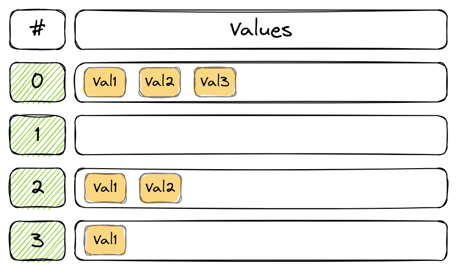
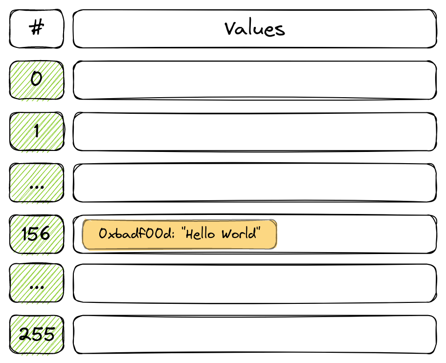
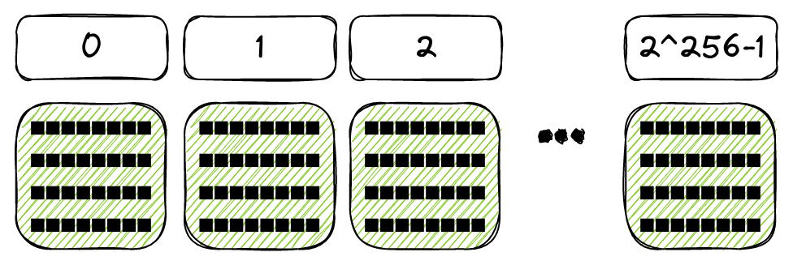
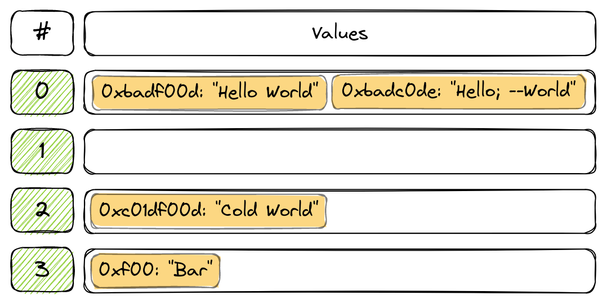
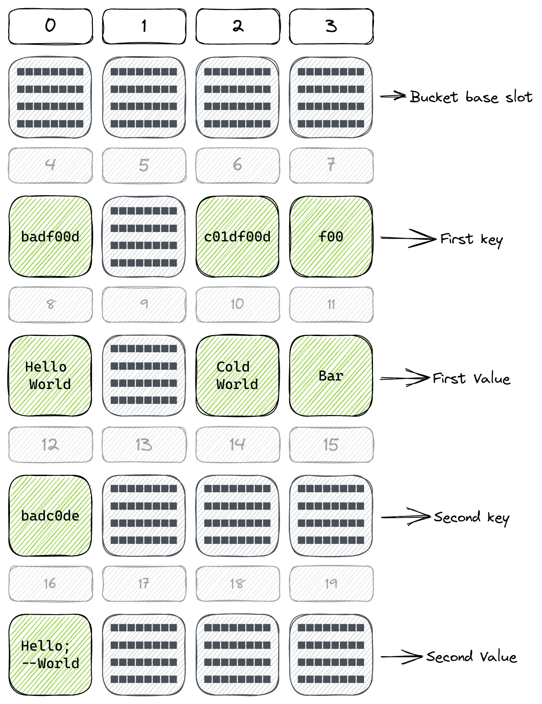

# Solidity HashMap
[](https://www.npmjs.com/package/solidity-hashmap)

Solidity famously lacks complex data-structures such as HashMaps, LinkedLists,
etc. `solidity-hashmap` is a true HashMap implementation for Solidity. 

This library is an attempt at implementing a true, efficient HashMap
data-structure in Solidity which includes all the familiar API methods you'd
expect a HashMap to support:
- `.get(bytes32 key): bytes32`
- `.set(bytes32 key, bytes32 value): void`
- `.size(): uint`
- `.keys(): bytes32[]`
- `.values(): bytes32[]`
- `.entries(): KV[]`
- `.contains(bytes32 key): bool`
- `.iterator(): HashMapIterator`

## Disclaimer
This is WIP. It probably contains bugs that would cause "storage slot
collisions". It is still not fully gas-optimized. I am looking for people
to review the code. If you understand what "storage slot collision" means and
would like to review the code, please contact me directly or by opening an
issue.

## When should I use a HashMap?
This `HashMap` implementation is storage-optimized. This means it is much
cheaper to write key/value pairs than with `EnumerableMap`. But this comes with
a trade-off — it is orders of magnitude more expensive to iterate.

Therefore, prefer a `HashMap` over `EnumerableMap` if you:
1. Will mostly be writing keys, not reading
1. Will be mostly appending values, with few deletions
1. Don't need to iterate over it inside non-view functions

## Why do we need a true HashMap?
The `mapping()` data-structure in Solidity is very interesting. It manages to be
very gas-efficient at O(1) while taking up 1 slot per key/value pair. This is
highly efficient, but has a serious drawback: 
Since the `mapping()` storage layout relies on hashing of keys, it is
impossible to enumerate mappings. You cannot iterate over them or infer what
keys they hold. Despite its name, it doesn't provide the same API as you'd
expect of a `Map` object in other languages.

This does not only affect smart-contract authors, but also off-chain data mining
services. The `mapping()` type creates an untraceable storage trie that makes it
much harder to index.

HashMap makes development more natural while allowing off-chain tools to easily
index your smart-contract data.

## Installation
Depending on what toolchain you are using, you will require different
installation methods.

### Foundry
If you are using Foundry, install using Forge:
```console
$ forge install tudmotu/solidity-hashmap
```

### Hardhat
If you are using Hardhat, install using NPM:
```console
$ npm i -D solidity-hashmap
```

## Usage
Usage is straightforward — import the library and use the `HashMap` type for your
variables.
```solidity
import 'solidity-hashmap/HashMap.sol';

contract Example {
    HashMap hashmap;

    constructor () {
        hashmap.set("key", "value");
        hashmap.get("key");
    }
}
```

### Iterator
You can lazily iterate over a HashMap instead of pulling all entries at once.
For that, you use a `HashMapIterator` instance, which can be create by invoking
`.iterator()` on a HashMap.

The `HashMapIterator` has the following API:
- `.hasNext()`
- `.next()`

You can iterate over the HashMap as long as the `iterator.hasNext()` returns
`true`:
```solidity
function findValueLargerThan10 (HashMap storage map) private returns (uint) {
    HashMapIterator memory iterator = map.iterator();
    while (iterator.hasNext()) {
        KV entry = iterator.next();
        uint val = uint(entry.value);
        if (val > 10) return val;
    }
}
```
With an iterator, you don't need to enumerate the entire HashMap — which is very
gas-consuming — in order to find a key or a value. It's still very gas intensive
and meant for view functions only.

### KV - Key/Value struct
The `KV` struct is a wrapper around two `bytes32` variables. It has two fields:
`.key` and `.value`.

## How does `HashMap` work?
This implementation is not a perfect HashMap implementation. This implementation
is EVM-specific and some implementation details either require workarounds, or
can't be implemented without incurring high gas fees. Below is a description of
the storage architecture.

### The hash table
HashMap implementations are usually based on a "Hash Table". A Hash Table is a
two-dimensional data structure, where each row has a "number" column and a
LinkedList or array of values. The rows are numbered sequentially and the table
has a specified "size" — meaning the amount of rows is limited.



The number of rows in the Hash Table is arbitrary. In non-blockchain VMs, it can
even change in run-time. Currently, this implementation does not support
changing the table size in run-time due to the associated gas costs.

In this implementation, we refer to the number of each row as a *"bucket"*.

### Saving values
To save a key/value pair in the Hash Table, we do two things:
1. We calculate the "bucket" of the key
1. We append the key/value pair at the tip of the bucket's list

To calculate the bucket of a key, we run it through `keccak256()`, then modulo
with the size of the Hash Table.

For example, if our Hash Table size is 256 and we want to save the key
"badf00d", we get the bucket `156`:
```solidity
keccak256(hex"badf00d") % 256
= 0x42c90d12a7423fdf083e3173b5158bb60b194185a3d0ca6ea9e0035e01be749c % 256
= 156
```

We then append our key/value pair to that bucket:


### Finding values
To find a value associated with a key, we need to traverse the Hash Table:
1. Find the bucket of the key
1. Iterate over the LinkedList until we find the key
1. Fetch the associated value

This means that `.get()` is not a perfect `O(1)`, but it will also never reach
`O(n)`. This gives us a good balance between performance, memory consumption and
developer experience.

### Storage Layout
Up till now, the above explanations were not specific to an EVM implementation.

So how is this actually implemented in the EVM?

HashMap utilizes a custom "storage layout". If you are unfamiliar with this
concept, check out the [relevant Solidity docs](https://docs.soliditylang.org/en/latest/internals/layout_in_storage.html).

Every contract deployed on Ethereum gets its own "storage space". This
storage space is composed of "slots" — individual blocks of 32 bytes. Slots are
numbered sequentially and have a range of [0..2<sup>256</sup>-1]:


You can read and write from any slot using the `sstore` and `sload` EVM op
codes:
```solidity
function increment () private returns (uint count) {
    assembly {
        count := sload(0)
        sstore(0, add(count, 1))
    }
}
```

So what does the HashMap storage layout looks like?
- The "base slot" contains the HashMap size (how many key/value pairs are
  stored in total)
- For every "bucket", we use 1 slot to store the size of the bucket (how many
  pairs exist in this specific bucket)
- From there on, key/value pairs are stored in slots that are separated by the
  bucket count of our HashMap 

To visualize this, let's say we have a Hash Map that uses 4 buckets:

Here we see that we have 4 rows and in 3 of these rows we have stored values:
- Row #0 contains:
    - 0xbadf00d: "Hello World"
    - 0xbadc0de: "Hello; --World"
- Row #1 is empty
- Row #2 contains:
    - 0xc01df00d: "Cold World"
- Row #3 contains:
    - 0xf00: "Bar"

The bucket for each value is not arbitrary. Remember, to determine the bucket of
a key/value pair, we hash the key and modulo it by 4 (our Hash Table size).

Next step in visualizing this, is to break the storage slot space into rows,
each row the length of our Hash Table size (in this case, 4):


Now, imaging a *pivoted* Hash Table, where each column in the storage slot space
is a "bucket", while the key/value pairs are stored on subsequent rows:


This is the gist of the storage layout of a HashMap. This does not depict
everything precisely, but it should help visualize the storage layout.

## Caveats
Currently this implementation has some notable caveats. Some of these might get
"fixed" and some will not, either due to technical or design limitations.
- Keys and values are `bytes32`. To set/get different values, they must be cast
appropriately
- Some of the methods (e.g. `.entries()`, `.values()`) are very gas-intensive
and are only appropriate in `view` functions called via RPC, where gas is not an
issue
- Keys cannot be an empty `bytes32`
- Only value-types are currently supported: numbers, addresses and strings
shorter than 32 bytes
- `memory` HashMaps are currently not supported
- A HashMap is almost O(1), but not quite. More keys means gas-efficiency might
deteriorate but it will never reach O(n)

## Comparison to alternatives
Two alternatives exist for HashMap:
1. Solidity's builtin `mapping()` data structure
1. OpenZeppelin [`EnumerableMap` implementation](https://github.com/OpenZeppelin/openzeppelin-contracts/blob/master/contracts/utils/structs/EnumerableMap.sol)

HashMap aims to find a balance between gas/storage efficiency, and developer
experience. While Solidity's `mapping()` is very gas & storage efficient, it is
not developer friendly at all. And while `EnumerableMap` is more developer
friendly, it is not storage-efficient.

HashMap finds a balance between storage, gas, and developer experience. HashMap
is both efficient in gas & storage, while providing a simple, familiar API.

### Gas costs comparison
| Test                           | HashMap       | EnumerableMap | Mapping       |
| ------------------------------ | ------------- | ------------- | ------------- |
| Write a single key             | 45,216        | 89,097        | 22,226        |
| Write 10k keys to map          | 460,930,127   | 674,363,767   | 225,201,867   |
| Write 100k keys to map         | 5,255,915,589 | 6,813,751,712 | 2,322,329,812 |
| Find a key in a 10k map        | 3,129         | 843           | 568           |
| Find a key in a single key map | 1,110         | 389           | 117           |
| Iterate over 10k keys          | 367,285,535   | 9,534,692     | 5,104,497     |
| Remove 10k keys                | 121,899,581   | 23,254,497    | 6,704,497     |
We can see that compared to `EnumerableMap`, `HashMap` has a distinct trade-off:
it is much cheaper to write and slightly more expensive to read, but
considerably more expensive to iterate.

In addition, HashMap is still WIP. There are some optimizations (such as using a
Balanced Tree instead of LinkedLists) that could reduce gas costs even further.

# Contributions
Contributions are welcome.

Please avoid opening unsolicited PRs without first discussing them in an issue.

If you encounter bugs, please report them in the repository.
