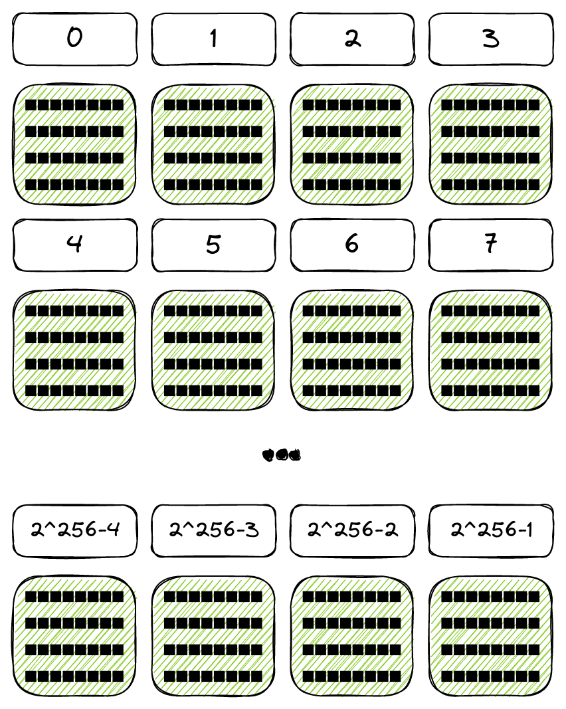

# #️⃣ Solidity HashMap
[](https://www.npmjs.com/package/solidity-hashmap)

Solidity famously lacks complex data-structures such as HashMaps, LinkedLists,
etc. `solidity-hashmap` is a true HashMap implementation for Solidity. 

This library is an attempt at implementing a true, efficient HashMap
data-structure in Solidity which includes all the familiar API methods you'd
expect a HashMap to support:
- `.get(key): Element`
- `.set(key, value): void`
- `.size(): uint`
- `.keys(): Element[]`
- `.values(): Element[]`
- `.entries(): Entry[]`
- `.contains(key): bool`
- `.iterator(): HashMapIterator`

The API includes multiple overloads for all value types and strings (shorter
than 32 bytes). See the [API section](#-api) for more information.

> ⚠️ **DISCLAIMER**  
> This library has not been used in production. It has not been audited and might
> still contain serious bugs. Use at your own risk.

## 📖 Table of contents

* [📦 Installation](#-installation)
* [🤔 Why `HashMap`](#-why-hashmap)
* [🔧 API](#-api)
* [✨ How does `HashMap` work?](#-how-does-hashmap-work)
* [⌨️ Contributions](#-contributions)

## 📦 Installation
Depending on what toolchain you are using, you will require different
installation methods.

### Foundry
If you are using Foundry, install using Forge:
```console
$ forge install tudmotu/solidity-hashmap
```

### Hardhat
If you are using Hardhat, install using NPM:
```console
$ npm i -D solidity-hashmap
```

## 🤔 Why `HashMap`

### Motivation
The `mapping()` data structure in Solidity provides very gas-efficient writes at
O(1), taking up 1 slot per key/value pair. This is highly efficient, but has a
serious drawback: 
It is impossible to enumerate mappings and despite its name, it doesn't provide
the same API as you'd expect of a `Map` object in other languages.

`HashMap` provides an enumerable yet write-efficient data structure.

### Comparison to alternatives
Two alternatives exist for HashMap:
1. Solidity's builtin `mapping()` data structure
1. OpenZeppelin [`EnumerableMap` implementation](https://github.com/OpenZeppelin/openzeppelin-contracts/blob/master/contracts/utils/structs/EnumerableMap.sol)

HashMap finds a balance between write-efficiency, and developer experience.
While `mapping()` is very efficient, it is not developer friendly and while
`EnumerableMap` is more developer friendly, it is not efficient.

Prefer a `HashMap` over `EnumerableMap` if you:
1. Write many keys
1. Rarely delete keys
1. Don't need to iterate over it onchain

#### Gas costs comparison
| Test                           | HashMap       | EnumerableMap | Mapping       |
| ------------------------------ | ------------- | ------------- | ------------- |
| Write a single key             | 45,232        | 89,097        | 22,226        |
| Write 10k keys to map          | 454,004,088   | 673,642,057   | 224,440,157   |
| Write 100k keys to map         | 4,554,460,568 | 6,736,222,036 | 2,244,400,136 |
| Find a key in a 10k map        | 1,252         | 524           | 249           |
| Find a key in a single key map | 1,126         | 389           | 117           |
| Iterate over 10k keys          | 221,074,548   | 7,250,322     | 2,910,127     |
| Remove 10k keys                | 64,816,013    | 20,970,127    | 4,390,127     |

We can see that compared to `EnumerableMap`, `HashMap` has a distinct trade-off:
it is much cheaper to write, but considerably more expensive to iterate.

### Caveats
- Keys cannot be empty when converted to `bytes32`:
    - `string` keys cannot be empty
    - `int`/`uint` keys cannot be `0`
- Only "value" types are supported: `bytes32`, `uint`, `int`, `address`,
`bool`, and `string` (shorter than 32 bytes)
- Literal variables (numbers, strings) must be explicitly converted to their
"value" types in order for the compiler to identify the correct overloads
- The `.entries()`, `.values()` and `.keys()` (and their variants) are very
gas-intensive and should only be used in `view` functions called via RPC where
gas is not an issue
- `memory` HashMaps are not supported
- A HashMap is almost O(1), but not quite. More keys means gas-efficiency might
deteriorate but it will never reach O(n)

## 🔧 API
Import the library and use the `HashMap` type in your contract:
```solidity
import 'solidity-hashmap/HashMap.sol';

contract Example {
    HashMap tokens;
    HashMap balances;

    function mint (address to, uint tokenId) external {
        require(tokens.get(tokenId).asAddress() == address(0));
        tokens.set(tokenId, to);
        balances.set(to, balances.get(to).asUint() + 1);
    }

    function ownerOf (uint tokenId) external returns (address owner) {
        owner = tokens.get(tokenId).asAddress();
    }

    function balanceOf (address owner) external returns (uint balance) {
        balance = balances.get(owner).asUint();
    }
}
```

### `.set(key, value): void`
To set key/value pairs, use the `.set(key, value)` function. Overloads are
included for all combinations of the following types: `bytes32`, `uint`, `int`,
`bool`, `address` and `string memory` (shorter than 32 bytes).

```solidity
contract Example {
    HashMap hashmap;

    constructor () {
        hashmap.set(address(0x1ee7c0de), string("test"));
        hashmap.set(string("key"), true);
        hashmap.set(uint(256), -30);
        hashmap.set(keccak256(hex"00"), address(0));
        hashmap.set(-1, uint(420))
    }
}
```

### `.get(key): Element`
The `.get()` method returns a type called `Element`. This type represents the
underlying value and has convenience methods for converting it into native
types. The `.get()` method includes overloads for the same types as `.set()`.

```solidity
contract Example {
    HashMap hashmap;

    constructor () {
        hashmap.get(address(0x1ee7c0de)).asString();
        hashmap.get(string("key")).asBool();
        hashmap.get(uint(256)).asInt();
        hashmap.get(keccak256(hex"00")).asAddress();
        hashmap.get(-1).asUint();
    }
}
```

### `Element` type
The `Element` type represents either a key or value in the `HashMap`. It is
technically a wrapper around `bytes32` but contains some special heuristics and
therefore should not be unwrapped directly.

The `Element` type exposes typed convenience methods:

- `.asBytes32(): bytes32`
- `.asBool(): bool`
- `.asAddress(): address`
- `.asUint(): uint`
- `.asInt(): int`
- `.asBytes(): bytes`
- `.asString(): string`

### `HashMapIterator`
To enumerate a `HashMap`, you use an iterator. Iterators are created by calling
`.iterator()` on a `HashMap`.

The `HashMapIterator` has the following API:
- `.hasNext(): bool`
- `.next(): Entry`

You can iterate over the `HashMap` as long as `iterator.hasNext()` returns
`true`:

```solidity
function findValueLargerThan10 (HashMap storage map) private returns (uint) {
    HashMapIterator memory iterator = map.iterator();

    while (iterator.hasNext()) {
        Entry memory entry = iterator.next();
        uint val = entry.value.asUint();
        if (val > 10) return val;
    }
}
```

With an iterator, you don't need to enumerate the entire HashMap — which is very
gas-consuming — in order to find a key or a value. It's still very gas intensive
and should still be used in `view` functions only.

### `Entry memory` type
The `Entry` type represents a key/value pair in the form of 2 `Element`
attributes: `.key` and `.value`. These attributes can be converted into
different native types using the `Element` convenience methods:

```solidity
contract Example {
    HashMap hashmap;

    constructor () {
        Entry memory entry = hashmap.get(string("key"));
        string memory key = entry.key.asString();
        uint value = entry.value.asUint();

        // You can also chain these methods
        uint aDifferentValue = hashmap.get(string("other")).value.asUint();
    }
}
```

### `.keys()`, `.values()` & and variants
The methods `.keys()` and `.values()` return an `Element[]` array of the
`HashMap` keys and values respectively.

In addition, `HashMap` has convenience methods that automatically convert the
`Element` variables into specific types:

- `.keysAsBytes32(): bytes32[]`
- `.keysAsAddress(): address[]`
- `.keysAsBool(): bool[]`
- `.keysAsUint(): uint[]`
- `.keysAsInt(): int[]`
- `.keysAsString(): string[]`
- `.valuesAsBytes32(): bytes32[]`
- `.valuesAsAddress(): address[]`
- `.valuesAsBool(): bool[]`
- `.valuesAsUint(): uint[]`
- `.valuesAsInt(): int[]`
- `.valuesAsString(): string[]`

### `.entries(): Entry[]`
Returns the list of all key/value pairs in the form of an `Entry[]` array.

### `.contains(key): bool`
Returns `true` if the key exists. Supports all the usual overloaded versions.

### `.remove(key): void`
Removes the key/value pair from the `HashMap`. Supports all the usual overloaded
versions.

## ✨ How does `HashMap` work?
This implementation is not a perfect HashMap implementation. This implementation
is EVM-specific and some implementation details either require workarounds, or
can't be implemented without incurring high gas fees. Below is a description of
the storage architecture.

### The hash table
HashMap implementations are usually based on a "Hash Table". A Hash Table is a
two-dimensional data structure, where each row has a "number" column and a
LinkedList or array of values. The rows are numbered sequentially and the table
has a specified "size" — meaning the amount of rows is limited.


The number of rows in the Hash Table is arbitrary. In non-blockchain VMs, it can
even change in run-time. This implementation does not support changing the table
size in run-time due to the associated gas costs.

In this implementation, we refer to the number of each row as a *"bucket"*.

### Saving values
To save a key/value pair in the Hash Table, we do two things:
1. We calculate the "bucket" of the key
1. We append the key/value pair at the tip of the bucket's list

To calculate the bucket of a key, we run it through `keccak256()`, then modulo
with the size of the Hash Table.

For example, if our Hash Table size is 256 and we want to save the key
"badf00d", we get the bucket `156`:
```solidity
keccak256(hex"badf00d") % 256
= 0x42c90d12a7423fdf083e3173b5158bb60b194185a3d0ca6ea9e0035e01be749c % 256
= 156
```

We then append our key/value pair to that bucket:


### Finding values
To find a value associated with a key, we need to traverse the Hash Table:
1. Find the bucket of the key
1. Iterate over the LinkedList until we find the key
1. Fetch the associated value

This means that `.get()` is not a perfect `O(1)`, but it will also never reach
`O(n)`. This gives us a good balance between performance, memory consumption and
developer experience.

### Storage Layout
Up till now, the above explanations were not specific to an EVM implementation.

So how is this actually implemented in the EVM?

HashMap utilizes a custom "storage layout". If you are unfamiliar with this
concept, check out the [relevant Solidity docs](https://docs.soliditylang.org/en/latest/internals/layout_in_storage.html).

Every contract deployed on Ethereum gets its own "storage space". This
storage space is composed of "slots" — individual blocks of 32 bytes. Slots are
numbered sequentially and have a range of [0..2<sup>256</sup>-1]:


You can read and write from any slot using the `sstore` and `sload` EVM op
codes:
```solidity
function increment () private returns (uint count) {
    assembly {
        count := sload(0)
        sstore(0, add(count, 1))
    }
}
```

To visualize the storage layout, let's say we have a Hash Map that uses 4 buckets:


Here we see that we have 4 rows and in 3 of these rows we have stored values:
- Row #0 contains:
    - `0xbadf00d`: "Hello World"
    - `0xbadc0de`: "Hello; --World"
- Row #1 is empty
- Row #2 contains:
    - `0xc01df00d`: "Cold World"
- Row #3 contains:
    - `0xf00`: "Bar"

The bucket for each value is not arbitrary. Remember, to determine the bucket of
a key/value pair, we hash the key and modulo it by 4 (our Hash Table size).

Next step in visualizing this, is to break the storage slot space into rows,
each row the length of our Hash Table size (in this case, 4):



Now, imagine a *pivoted* Hash Table, where each column in the storage slot space
is a "bucket", while the key/value pairs are stored on subsequent rows:


This is the gist of the storage layout of a HashMap. This does not depict
everything precisely, but it should help visualize the storage layout.

## ⌨️ Contributions
Contributions are welcome.

Please avoid opening unsolicited PRs without first discussing them in an issue.

If you encounter bugs, please report them in the repository.
